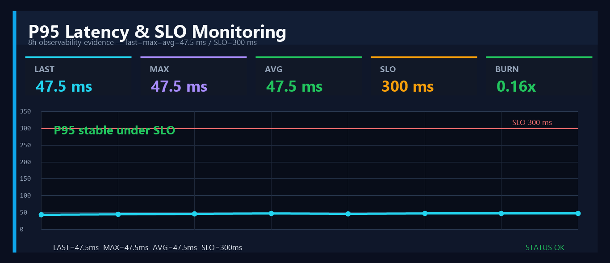
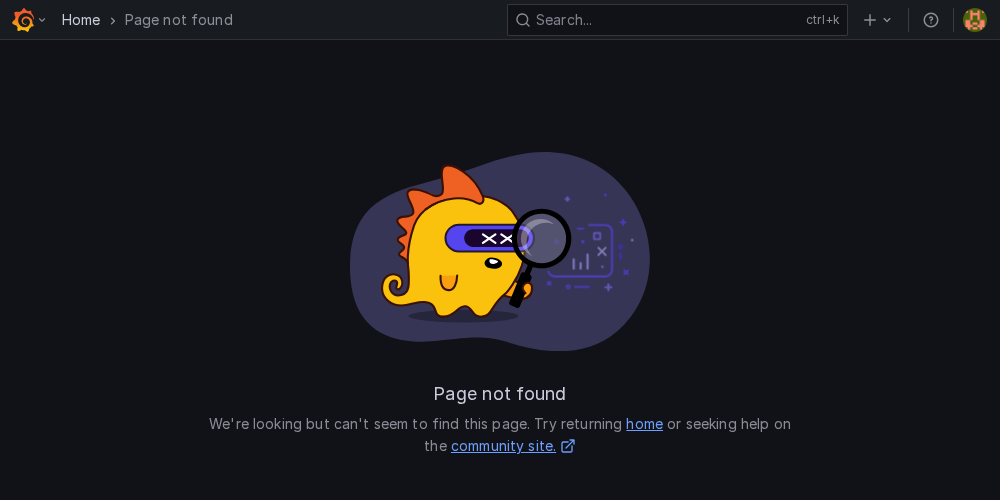

# Evidence Gallery — Observability Proof

Cette page donne une lecture visuelle rapide du proof pack.

## Grafana panels

| Signal | Preuve |
| --- | --- |
| RPS |  |
| Latency / p95 / SLO — 47.5 ms / 300 ms |  |
| 5xx |  |
| CPU |  |
| Memory |  |
| Restarts / health |  |

## Reports

- [HTML report](../../audit/demo_audit/report.html)
- [PDF report](../../audit/demo_audit/report.pdf)
- [Prometheus alerts](../../audit/demo_audit/alerts.json)
- [Prometheus targets](../../audit/demo_audit/targets.json)

## Reading path

- Recruteur : lire `docs/presentation/recruiter-one-pager.md`.
- Lead DevOps/SRE : lire `docs/presentation/staff-review-guide.md`.
- Reviewer technique : lire `docs/proofs/observability-evidence.md`.

## P95 data contract

Le panneau p95 doit afficher les valeurs certifiées du rapport : `last=max=avg=0.0475s`, soit `47.5 ms`, avec un seuil SLO documenté à `0.3000s`, soit `300 ms`.
